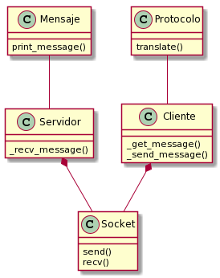

# Informe Trabajo Práctico 1

Nombre: Lautaro Gastón Fritz

Padrón: 102320

Enlace al repositorio de GitHub: https://github.com/lautarofritz/tp1

## Introducción

En el presente informe se detalla la resolución del Trabajo Práctico 1, el cual consistía en la implementación de dos programas (un cliente y un servidor), que se comunican por medio del Protocolo D-Bus.

A continuación se detallan cuestiones tales como el diseño de las aplicaciones y las decisiones detrás de él, y algunos de los problemas encontrados a lo largo del desarrollo.

## Diseño

Se optó por tener un Protocolo que no forme parte de la comunicación entre las partes, sino que simplemente oficie de traductor para el mensaje que le pase el Cliente. Por otro lado, pareció lógico tener un Socket tanto en el Cliente como en el Servidor, para facilitar la comunicación entre ambos. En la decisión influyó también el hecho de que el Servidor debe respoderle al Cliente luego de recibir un mensaje, y que a esta respuesta no se la traduce al formato propuesto, sino que se envía como viene, por lo tanto, no parece lo mejor hacer que esta pase por el Protocolo.

A continuación se muestra un diagrama con los Tipo de Dato Abstracto que componen el modelo:

En algún momento se pensó en tener un TDA entre el Cliente y el Protocolo, que fuera el encargado de abrir el archivo y de extraer las líneas para enviárselas al Protocolo para que este las tradujera, pero complicaba la recepción del mensaje traducido por parte del Cliente, y la función que venía a cumplir no parecía enteramente fuera de lugar si fuera ejecutada por el Cliente, por lo que se decidió descartarlo. 

Por otra parte, es el Servidor el que decodifica el mensaje una vez recibido. Se tuvo la idea de que el Servidor le enviara el mensaje al Protocolo una vez que lo hubiera recibido, para que fuera él quien lo decodificara, pero quizás era cargar al Protocolo con demasiada responsabilidad.

Al igual que con el Cliente y los archivos, se barajó la posibilidad de hacer un TDA específico para la muestra del mensaje por pantalla. Como sucedió en el caso anterior, el papel que jugaba este TDA quizás no era lo suficientemente importante como para justificar su creación. Sin embargo, este fue agregado para la reentrega, ya que también es cierto que le quita esta responsabilidad 
de encima al Servidor. Con el diseño anterior, el Servidor tenía mucha más responsabilidad.

Por último, todos los TDAs (salvo Socket) se relacionan con un TDA Swapper, que invierte los bytes de un número dado si la arquitectura es big endian, mientras que devuelve el número tal como lo recibió si es little. Esta TDA no figura en el diagrama ya que tiene una función más bien oculta.

## Detalles de implementación y problemas encontrados

A continuación se expone una vista más profunda de las distintas etapas de ejecución del programa, junto con algunos inconvenientes hallados durante el desarrollo.

### Extracción de las líneas del archivo

Como se dijo más arriba, esta función está a cargo del Cliente. A grandes rasgos, se toman 32 bytes del archivo, los cuales son cargados en un buffer, y este es recorrido hasta encontrar un caracter de nueva línea ('\n') o hasta que se llegó al final y dicho caracter no fue encontrado. Una vez finalizado este recorrido, se copian los 32 caracteres del buffer (o los n caracteres previos a la aparición del '\n') en otro buffer dinámico que crece a medida. Al encontrar este caracter, se setea un flag para que no se sigan extrayendo caracteres del archivo, y se setea el puntero del archivo al primer caracter de la línea siguiente.

Si no se pueden extraer 32 bytes del archivo, sino que esta cantidad es menor, se sabe que se llegó al fin del archivo. En este caso, se cambia el valor de un booleano que indica dicho suceso. El Cliente, entonces, no vuelve a llamar a la función.

### Traducción del mensaje al formato

Para la traducción del mensaje, el Cliente le otorga un buffer que contiene el mensaje extraído del archivo, cuyo contenido puede ser (y es) modificado por el Protocolo. Este va recorriéndolo y almacenando el mensaje traducido, junto con las longitudes correspondientes, en tres buffers (uno para la cabecera, otro para la firma y otro para el cuerpo). Luego, concatena los contenidos de estos tres buffers y guarda el resultado en el buffer provisto por el Cliente. Además, le devuelve la cantidad de bytes de padding de la firma. Esta última decisión se detalla en la sección de abajo.

### Envío y recepción del mensaje

El mensaje es enviado y recibido en tres partes: primero se mandan los 16 bytes iniciales, que contienen la longitud tanto del cuerpo como de la cabecera, para que el Servidor pueda proveer los buffers de tamaño correspondiente, y luego se procede con el envío de las partes restantes. 

El Cliente es el encargado de otorgarle el mensaje dividido al socket para el envío. Esto generó un problema, ya que los bytes de padding de la firma no se encuentran como información disponible en los primeros bytes del mensaje, por lo que el Cliente no puede establecer el offset adecuado para enviar el cuerpo del mensaje, esto es, 16 bytes iniciales + longitud de la cabecera + bytes de padding de la firma.

Se pensó en enviar el mensaje en dos partes únicamente: los 16 bytes iniciales y cuerpo y cabecera juntos por otro lado. De esta forma, el Servidor tendría que proveer un buffer de longitud de cabecera + longitud de cuerpo + padding de la firma, pero este último valor es desconocido. Por lo tanto se otorgaría un buffer de longitud de cabecera + longitud de cuerpo + 7, siendo 7 la máxima cantidad de bytes de padding para la firma, y que de última el buffer quedara con algunos bytes sin rellenar. Sin embargo, esta solución generaba inconvenientes difíciles de resolver en la lógica del ciclo `while` utilizado en la función `socket_receive()`, por lo que se decidió descartarla y seguir con la solución propuesta arriba.

Otra alternativa viable habría sido que todos los buffers provistos por el Servidor para la recepción tuvieran un tamaño máximo establecido previamente, y que cualquier mensaje que superara dicho tamaño se vea cortado. Como se ve, esta solución habría sido un poco menos dañina para el encapsulamiento del Cliente, ya que este no necesariamente tiene porque saber de la existencia de bytes de padding en la firma, pero tiene la desventaja de perder flexibilidad al establecer un tamaño máximo fijo.

### Muestra por pantalla y respuesta

Una vez recibido el mensaje, el Servidor delega esta responsabilidad al TDA Mensaje, el cual lee los parámetros del mensaje y los va imprimiendo por pantalla, primero de la cabecera, y luego del cuerpo (si es que hay). Una vez hecho esto, el Servidor envía la respuesta al Cliente, y vuelve a esperar el envío de nuevos mensajes.

### Fin de la conexión

El Cliente finaliza la conexión una vez que terminó de leer el archivo con los mensajes a enviar. El Servidor, por su parte, queda esperando mensajes hasta que sucede esto. En la recepción de la primera parte (los 16 bytes iniciales), hay un chequeo del valor de retorno. Si este es 0, significa que el Cliente se desconectó, por lo que el también lo hace.